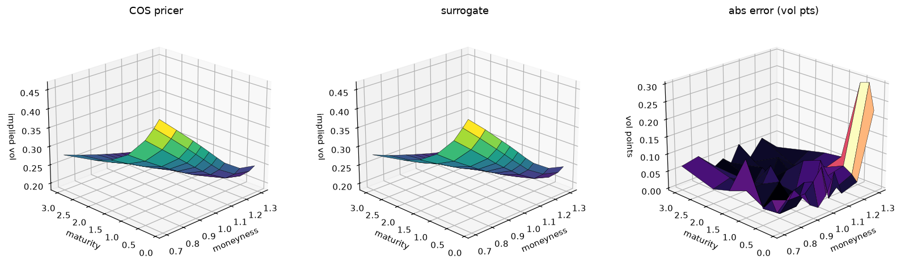
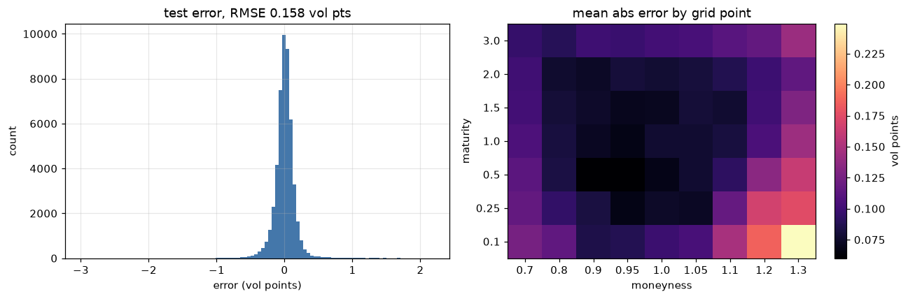
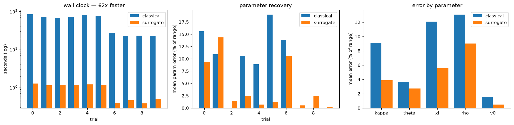
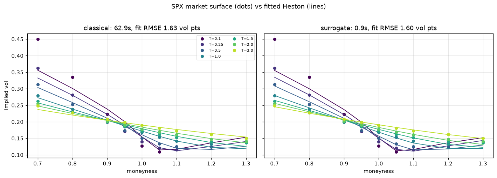

# Deep calibration of the Heston model

Calibrating a stochastic volatility model means searching parameter space for the
set that reproduces an observed implied-vol surface, re-pricing the whole surface
at every candidate. The pricer is the bottleneck.

This trains a small neural network to imitate the pricer, then calibrates through
the network instead: freeze the weights and run gradient descent on the *inputs*,
with exact gradients from autograd. On SPX that is a 69x speedup for the same fit.

Following:

- Horvath, Muguruza & Tomas (2019), *Deep Learning Volatility*, [arXiv:1901.09647](https://arxiv.org/abs/1901.09647)
- Bayer, Horvath, Muguruza, Stemper & Tomas, *On Deep Calibration of (rough) Stochastic Volatility Models*, [arXiv:1908.08806](https://arxiv.org/abs/1908.08806)

My own implementation. The authors' reference code
([amuguruza/NN-StochVol-Calibrations](https://github.com/amuguruza/NN-StochVol-Calibrations))
was used as a sanity check on parameter ranges and network size, not as a source.

## How it works

1. A COS-method pricer (Fang & Oosterlee 2008) prices European calls from the
   Heston characteristic function.
2. Sample Heston parameters, price a 9-moneyness x 7-maturity implied-vol surface
   for each, and keep the pairs as training data.
3. Train a feedforward net mapping the 5 parameters to the 63-point surface.
4. Freeze it. To calibrate, optimise the 5 inputs by gradient descent until the
   predicted surface matches the observed one.

Implied vols are the target rather than prices: prices span orders of magnitude
across the grid, implied vols sit in a narrow band and are a far better
conditioned regression problem.

## The surrogate

5,916 training surfaces, 788 validation, 790 test, all independently drawn.
3 hidden layers of 64 units, ELU, Adam with early stopping (stopped at epoch 207).

ELU rather than ReLU because calibration runs gradient descent through this
network, and ELU keeps those gradients smooth.

| metric | vol points |
|---|---|
| test RMSE | 0.16 |
| test MAE | 0.10 |
| max abs error | 2.97 |

One vol point is 0.01, e.g. 20% vs 21% implied vol.



The two surfaces are visually identical; the error panel is the interesting one.
Error concentrates at short-dated deep out-of-the-money points, where the surface
is steepest and the training data thinnest.



## Calibration on synthetic surfaces

Ten surfaces generated from known parameters, both methods starting from the
midpoint of every range. Classical is Nelder-Mead calling the COS pricer directly;
surrogate is Adam on the frozen network's inputs, reparametrised through a sigmoid
so the box constraints hold without clipping.

| method | avg time | mean parameter error (% of range) |
|---|---|---|
| classical | 54.8s | 7.89% |
| surrogate | 0.89s | 4.32% |
| **speedup** | **61x** | |



The average understates what is happening. Nelder-Mead is bimodal: on 4 of 10
trials it lands within 0.03% of the true parameters, and on the other 6 it stalls
between 9% and 19%. Derivative-free simplex search in 5 dimensions either falls
into the right basin within its iteration budget or it does not. The surrogate is
less spectacular at its best but far more consistent, which is the honest claim:
not more accurate, more reliable.

The trade-off is exact gradients of an approximate model against no gradients of
the exact model.

Per-parameter errors show kappa is much harder to recover than the rest: the
surface is fairly insensitive to mean-reversion speed, so quite different values
fit almost equally well. The market section below is graded on surface fit
instead.

## Calibration to SPX

Option chains come from Yahoo via `yfinance`. No rate or dividend assumption
enters anywhere:

- **Forward and discount from put-call parity.** C - P = D(F - K) is linear in K,
  so regressing call-minus-put on strike across the ten strikes nearest spot gives
  both D and F directly from quoted prices.
- **Black-76 implied vols off that forward.** Out-of-the-money side only, where
  spreads are tightest. Quoting against the forward means carry is already
  accounted for, so the market surface lines up with the training grid.
- **Interpolation onto the grid** in log forward moneyness across strikes, and in
  total variance across maturities.

Quotes are dropped without a two-sided market, with a spread wider than 25% of
mid, or with no open interest: roughly 14,500 raw quotes become 7,000 usable ones
across 38 expiries, filling 56 of the 63 grid points. The 7 gaps are
out-of-the-money calls at short maturities, which SPX simply does not quote that
far out; the objective masks them rather than filling them.

| method | time | fit RMSE (vol points) |
|---|---|---|
| classical | 62.9s | 1.63 |
| surrogate | 0.91s | 1.60 |
| **speedup** | **69x** | |



Both methods land on essentially the same parameters and the same fit quality. The
surrogate reproduces what direct optimisation against the pricer achieves, in
under a second.

## What the results say

**The surrogate is not the binding constraint.** It reproduces the COS pricer to
0.16 vol points. Heston itself only reproduces SPX to 1.6 vol points, ten times
worse. The approximation introduced by replacing the pricer is an order of
magnitude smaller than the error already present in the model being calibrated.

**Heston cannot fit the short-dated skew.** In the chart above the fit tracks the
market from moneyness 0.8 upward, then misses the downside wing badly: 45% quoted
against 36% fitted at moneyness 0.7, one month. Heston is known to struggle to
produce enough skew at short maturities, which is a large part of why rough
volatility models exist.

**Vol-of-vol pins at its upper bound.** Both methods push xi to the edge of the
sampled range on real data. The ranges were chosen to cover plausible equity
surfaces; real SPX wants more. Widening it would improve the fit somewhat, though
not the short-dated wing, which is a model limitation rather than a range one.

**Interpolation is a real cost of the approach.** The network only predicts on the
grid it was trained on, so market quotes have to be interpolated onto it. A pricer
can be called at any strike and maturity. That is the main practical downside of
the surrogate route.

## What is not here

**Rough Bergomi**, the harder case both papers cover and the model that would
address the short-dated skew failure above. It needs Monte Carlo simulation to
generate training labels at all, since there is no semi-closed-form pricer to lean
on the way COS serves Heston. That is a meaningfully larger undertaking.

**Dividends as a modelled quantity.** Working in forward space sidesteps them,
which is fine for fitting a surface, but pricing back out to absolute option
prices would need a dividend yield in the pricer.

**A single snapshot**, not a time series. How stable the calibrated parameters are
day to day is the obvious next question and is not answered here.

## Running it

```
pip install -r requirements.txt
python -m src.data_gen          # ~7 min, writes data/heston_surfaces.npz
python -m src.train_surrogate   # trains, writes models/vol_surrogate.pt
python -m src.model_calibration # synthetic comparison
python -m src.market_data       # pulls SPX and prints the market surface
pytest                          # 35 tests
```

`notebooks/train.ipynb` and `notebooks/calibration.ipynb` produce the charts above.
Training runs are tracked with MLflow (`mlflow ui`).

Generated data and model weights are gitignored and reproduce from seed 100.
